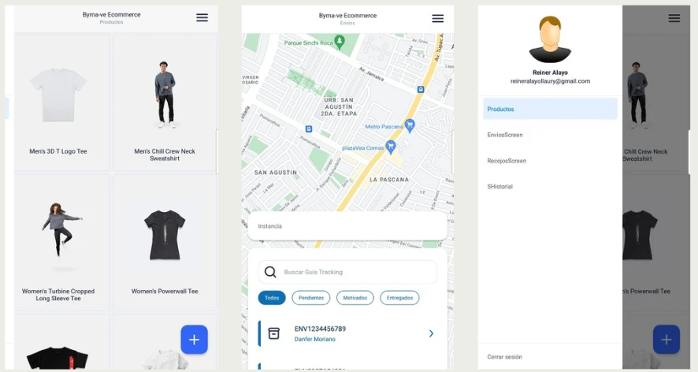

# Aplicacion E-Commerce

## Descripción

Desarrollo de una aplicación móvil e-commerce administrativa para el listado de productos, visualización de envíos y productos recogidos.

## Features

- **Componentes Reutilizables:** Diseño modular usando UI Kitten para la elaboración de una interfaz responsiva y uniforme.
- **Gestión de Datos Locales:** Almacenamiento de información del usuario usando AsyncStorage.
- **Geolocalización:** Actualización en tiempo real de la ubicación del usuario con Geolocation y React Native Maps.
- **Navegación Fluida:** Manejo de múltiples pantallas y menús laterales con React Navigation y Drawer.
- **Manejo de Formularios:** Uso de Formik para validación y gestión eficiente de formularios.
- **Consultas a API:** Integración con APIs mediante Axios y manejo de datos asíncronos con React Query.
- **Estados Globales:** Gestión del estado de la aplicación usando Zustand.

## Technologies

- **React Native** para aplicaciones móviles.
- **TypeScript** para tipado estático y mejor mantenimiento del código.

## Platforms

Android
